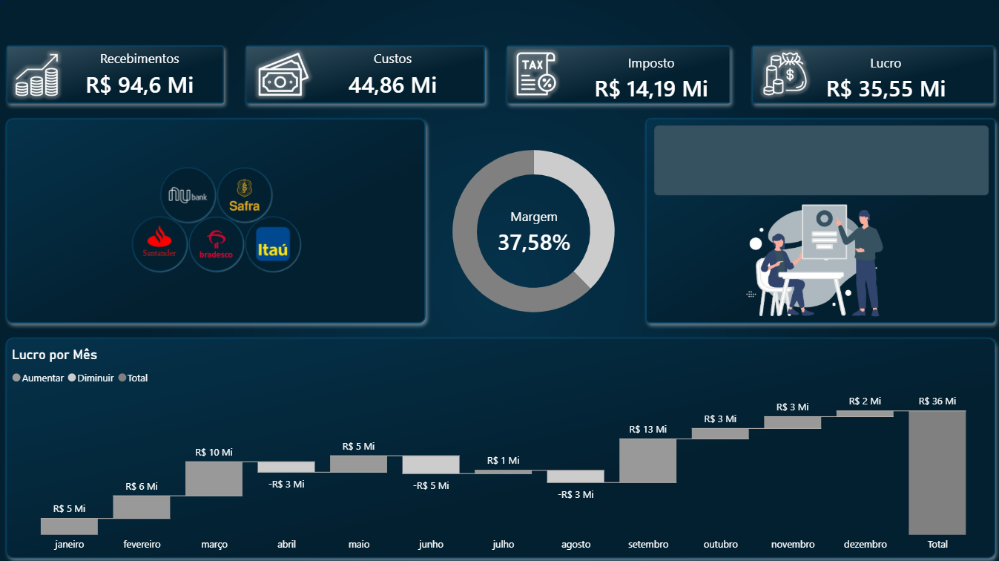

# Dashboard-Financeiro_2_powerbi
Nesse desafio foi desenvolvido um segundo dashboard de finanças

📊 Qual foi o lucro por mês?
📊Qual foi o total de recebimentos?
📊Qual foi o custo?
📊 Qual foi o imposto?
📊Qual foi o lucro total?
📊Qual é a margem?

 
